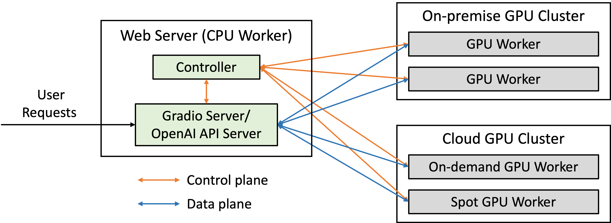

# Serving LLms

>   **为什么要封装成API管理**
>
>   1.   前后端解耦方便管理
>   2.   易于开发, 大模型开发工具很多都用API方式去调用.
>   3.   API 本身好处: 并发负载管理, 复用性提高, 易于扩展
>   4.   版本控制和迭代.
>
>   举个例子: 如果单纯加载到内存一个进程里面, 该模型只能为这个单一一个进程服务, 就会使得硬件资源利用率低


~~推理部署框架对比参考文档: [**serving framework comparision_23.12**](https://medium.com/@plthiyagu/comparing-llm-serving-frameworks-llmops-f02505864754)~~

-   ~~综合来看, **Open-LLM**是最好的~~
-   ~~后期考虑使用 vLLM或者llama.cpp (推理加速)~~
-   ~~FastChat也提供类似openai的api接口管理服务~~

踩了很多坑: 

-   openllm, fastchat 基本都会兼容vLLM框架, 但是vLLM目前无法多卡部署, 主要原因是无法拉起 ray 集群, 原因不明
-   目前先采用 FastChat 管理, 仍存在问题
    -   暂时没采用 vLLM 加速推理
    -   自动多卡加载时, 无法内存均衡分配, 需要手动配置


**update: 2024-03-21** 

目前采用的是 FastChat 接口管理, 下面是



**实战代码如下:**  [FastChat--github](https://github.com/lm-sys/FastChat)

- [ ] start controller
- [ ] start model worker
- [ ] start openai serer

**ref:** [fastchat+vllm](http://www.chinasem.cn/article/638687)


## CLI 命令行交互

```shell
# cli
python3 -m fastchat.serve.cli --model-path /public/llm/models/Qwen1.5-7B-Chat \
        --num-gpus 2 \
        --max-gpu-memory 4GiB\
        --load-8bit

```

## Controller

```shell
python3 -m fastchat.serve.controller --host 0.0.0.0 
```

### controller params

```shell
--host参数指定应用程序绑定的主机名或IP地址。默认情况下，应用程序将绑定在本地回环地址（即localhost或127.0.0.1）上。
--port参数指定应用程序监听的端口号。默认情况下，应用程序将监听21001端口。
--dispatch-method参数指定请求调度算法。lottery表示抽奖式随机分配请求，shortest_queue表示将请求分配给队列最短的服务器。默认情况下，使用抽奖式随机分配请求。
--ssl参数指示应用程序是否使用SSL加密协议。如果指定了此参数，则应用程序将使用HTTPS协议。否则，应用程序将使用HTTP协议。
```

## model worker

```shell
# serve with multiple models

# worker 0
CUDA_VISIBLE_DEVICES=0 python3 -m fastchat.serve.model_worker \
    --model-path lmsys/vicuna-7b-v1.5 \
    --controller http://localhost:21001 \
    --port 31000 \
    --worker http://localhost:31000

# worker 1
CUDA_VISIBLE_DEVICES=1 python3 -m fastchat.serve.model_worker \
    --model-path lmsys/fastchat-t5-3b-v1.0 \
    --controller http://localhost:21001 \
    --port 31001 \
    --worker http://localhost:31001

# serve with vllm
python -m fastchat.serve.vllm_worker ...
```

### worker params

```shel
--host HOST：指定该工作节点的主机名或 IP 地址，默认为 localhost。
--port PORT：指定该工作节点监听的端口号，默认为 8000。
--worker-address WORKER_ADDRESS：指定该工作节点的地址。如果未指定，则自动从网络配置中获取。
--controller-address CONTROLLER_ADDRESS：指定控制节点的地址。如果未指定，则自动从环境变量中获取。如果环境变量也未设置，则默认使用 http://localhost:8001。
--model-path MODEL_PATH：指定模型文件的路径。如果未指定，则默认使用 models/model.ckpt。
--model-names MODEL_NAMES：指定要加载的模型名称。该参数只在多模型情况下才需要使用。
--limit-worker-concurrency LIMIT_WORKER_CONCURRENCY：指定最大并发工作进程数。默认为 None，表示不限制。
--no-register：禁止在控制节点上注册该工作节点。
--num-gpus NUM_GPUS：指定使用的 GPU 数量。默认为 1。
--conv-template CONV_TEMPLATE：指定对话生成的模板文件路径。如果未指定，则默认使用 conversation_template.json。
--trust_remote_code：启用远程代码信任模式。
--gpu_memory_utilization GPU_MEMORY_UTILIZATION：指定 GPU 内存使用率，范围为 [0,1]。默认为 1.0，表示占用全部 GPU 内存。
--model MODEL：指定要加载的模型类型。默认为 fastchat.serve.vllm_worker.VLLMModel。
--tokenizer TOKENIZER：指定要使用的分词器类型。默认为 huggingface。
--revision REVISION：指定加载的模型版本号。默认为 None，表示加载最新版本。
--tokenizer-revision TOKENIZER_REVISION：指定加载的分词器版本号。默认为 None，表示加载最新版本。
--tokenizer-mode {auto,slow}：指定分词器模式。默认为 auto，表示自动选择最佳模式。
--download-dir DOWNLOAD_DIR：指定模型下载目录。默认为 downloads/。
--load-format {auto,pt,safetensors,npcache,dummy}：指定模型加载格式。默认为 auto，表示自动选择最佳格式。
--dtype {auto,half,float16,bfloat16,float,float32}：指定模型数据类型。默认为 auto，表示自动选择最佳类型。
--max-model-len MAX_MODEL_LEN：指定模型的最大长度。默认为 None，表示不限制。
--worker-use-ray：启用 Ray 分布式训练模式。
--pipeline-parallel-size PIPELINE_PARALLEL_SIZE：指定管道并行的大小。默认为 None，表示不使用管道并行。
--tensor-parallel-size TENSOR_PARALLEL_SIZE：指定张量并行的大小。默认为 None，表示不使用张量并行。
--max-parallel-loading-workers MAX_PARALLEL_LOADING_WORKERS：指定最大并发加载工作数。默认为 4。
--block-size {8,16,32}：指定块大小。默认为 16。
--seed SEED：指定随机种子。默认为 None。
--swap-space SWAP_SPACE：指定交换空间的大小。默认为 4GB。
--max-num-batched-tokens MAX_NUM_BATCHED_TOKENS：指定每个批次的最大令牌数。默认为 2048。
--max-num-seqs MAX_NUM_SEQS：指定每个批次的最大序列数。默认为 64。
--max-paddings MAX_PADDINGS：指定每个批次的最大填充数。默认为 1024。
--disable-log-stats：禁止记录统计信息。
--quantization {awq,gptq,squeezellm,None}：指定模型量化类型。默认为 None，表示不进行量化。
--enforce-eager：强制启用 Eager Execution 模式。
--max-context-len-to-capture MAX_CONTEXT_LEN_TO_CAPTURE：指定要捕获的上下文长度。默认为 1024。
--engine-use-ray：在引擎中启用 Ray 分布式训练模式。
--disable-log-requests：禁止记录请求信息。
--max-log-len MAX_LOG_LEN：指定最大日志长度。默认为 10240。
```

## openai server

```shell
python3 -m fastchat.serve.openai_api_server --host 0.0.0.0 --port 8000
```

## Using Langchian

```python
import openai

openai.api_key = "EMPTY"
openai.base_url = "http://localhost:8000/v1/"

model = "vicuna-7b-v1.5"
prompt = "Once upon a time"

# create a completion
completion = openai.completions.create(model=model, prompt=prompt, max_tokens=64)
# print the completion
print(prompt + completion.choices[0].text)

# create a chat completion
completion = openai.chat.completions.create(
  model=model,
  messages=[{"role": "user", "content": "Hello! What is your name?"}]
)
# print the completion
print(completion.choices[0].message.content)
```

## Archive

```shell

# cli
python3 -m fastchat.serve.cli --model-path /public/llm/models/Qwen1.5-7B-Chat \
        --num-gpus 2 \
        --max-gpu-memory 4GiB\
        --load-8bit

# -- controler
'''
--host参数指定应用程序绑定的主机名或IP地址。默认情况下，应用程序将绑定在本地回环地址（即localhost或127.0.0.1）上。
--port参数指定应用程序监听的端口号。默认情况下，应用程序将监听21001端口。
--dispatch-method参数指定请求调度算法。lottery表示抽奖式随机分配请求，shortest_queue表示将请求分配给队列最短的服务器。默认情况下，使用抽奖式随机分配请求。
--ssl参数指示应用程序是否使用SSL加密协议。如果指定了此参数，则应用程序将使用HTTPS协议。否则，应用程序将使用HTTP协议。
'''
python -m fastchat.serve.controller --host 0.0.0.0

# -- serve with multiple worker
# worker 0
CUDA_VISIBLE_DEVICES=0 python3 -m fastchat.serve.model_worker \
    --model-path lmsys/vicuna-7b-v1.5 \
    --controller http://localhost:21001 \
    --port 31000 \
    --worker http://localhost:31000

# worker 1
CUDA_VISIBLE_DEVICES=1 python3 -m fastchat.serve.model_worker \
    --model-path lmsys/fastchat-t5-3b-v1.0 \
    --controller http://localhost:21001 \
    --port 31001 \
    --worker http://localhost:31001


python3 -m fastchat.serve.model_worker --num-gpus 2 --model-path /public/llm/models/Qwen1.5-7B-Chat 
python3 -m fastchat.serve.cli --model-path /public/llm/models/Qwen1.5-72B-Chat --num-gpus 4

python3 -m fastchat.serve.controller &
nohup CUDA_VISIBLE_DEVICES=3 python3 -m fastchat.serve.model_worker --model-path /public/llm/models/Qwen1.5-0.5B-Chat &
nohup python3 -m fastchat.serve.openai_api_server --host 0.0.0.0 --port 8201 &

curl http://10.44.201.97:8201/v1/models

curl http://localhost:8201/v1/chat/completions \
  -H "Content-Type: application/json" \
  -d '{
    "model": "Qwen1.5-0.5B-Chat",
    "messages": [{"role": "user", "content": "Hello! What is your name?"}]
  }'
```


