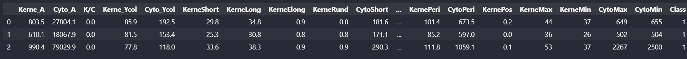

# 用GPT-4 做数据分析

LLM 可以很好地根据用户目的生成代码, 但在逻辑推理层面尤其是数学复杂逻辑推理方面容易出现错误. 但这并不妨碍大语言模型做数据分析, 只要将生成好的代码, 提供到另外一个环境执行并读取结果即可. 所以我这里想通过一个用户案例来利用 Chatgpt(gpt4) 去做数据分析. 

重要Feature:

1.   根据用户意图结合数据自动生成数据分析代码并执行
2.   延展用户意图, 做更专业化的操作. 例如:
     1.   提示: 描述性数据分析 -> 自动画图
     2.   提示: 评估模型性能 -> 自动交叉验证

3.   代码自动纠错.
4.   结合大语言模型庞大的知识, 帮助用户推断和分析得到可靠的数据分析结论. 
     1.   下面案例中, 模型自动推断出每个字段的含义
     2.   根据字段数据类型的不同, 模型自动对不同数据类型的字段进行不同的数据分析
     3.   根据数据分布和数据类型, 自动选择需要绘制的图片类型(散点图, 柱状图等)

下面就是整个数据分析的案例. 主要分为几个步骤

1.   读取数据, 并描述数据内容
2.   数据清洗以及描述性数据分析
3.   构建二分类模型
4.   特征进行重要性排序
5.   聚类分析
6.   生成数据分析报告并下载

---

## 0. 数据介绍

这是一份**医学公开数据集**, 其中包含了细胞的一些数值型特征, 还有其分类. 共23列数据, 其中前20列为特征数据, 后三列为分类数据. 另外共有917个样本.




其中特征数据的描述如下, 

```text
Kerne_A：核面积  
Cyto_A：浆面积  
K/C：核浆比  
Kerne_Ycol：核颜色  
Cyto_Ycol：浆颜色  
KerneShort：核短轴  
KerneLong：核长轴  
KerneRund：核圆度  
CytoShort：浆短轴  
CytoLong：浆长轴  
CytoRund：浆圆度  
```

我们便以此数据, 开展我们的数据分析

## 1. 读取数据

**用户**:


**机器人**:


可以看出, chatgpt 先自动生成读取数据的代码并执行, 并根据数据的信息, 自动推断出字段的意义. 


## 2. 数据清洗及描述性的数据分析


## 3. 构建逻辑回归二分类模型并对特征重要性进行评估


-   模型自动根据用户意图将非特征数据去除了(标签类的数据, 和id类的数据)

-   自动实现了交叉验证, 利用验证集对模型性能进行了评估


## 4. 对特征进行重要性排序, 并解释


-   同样, 这里模型引入**额外的知识**尝试对特征重要性进行解释

## 5. 聚类分析


-   有意思的是, 这里的代码实现了自动纠错, 一开始的代码出现了问题, 但随后模型便实现了自动重新修改了代码
-   而且, 模型引入了额外的知识, 我这里只是叫他实现了可视化操作, 但他自动利用数据进行 PCA 降维, 保证了上下文的可执行性


## 6. 自动生成文档报告下载


*错误*: 这里gpt生成的文档不是很好, 存在很多小问题, 猜测造成的原因是一次性生成的代码token过长

>   优化的地方: 如果提前告诉模型, 让他将图片保存下载, 估计出错的概率会更低一些

**文档截图**: 共重复执行了3次.

1.   第一次

     

     2.   第二次:

     

     

## 总结

>   下面这段话是gpt自动生成的

这篇文章深入探讨了如何利用GPT-4进行高级数据分析。它覆盖了从数据读取、清洗、描述性分析到逻辑回归模型构建、特征重要性评估、聚类分析等多个方面。文章通过具体示例展示了GPT-4的能力，不仅包括自动生成和执行数据分析代码，还涵盖了自动纠错和报告生成。此外，还讨论了用户与模型互动的重要性，强调了专业知识在有效使用GPT-4进行数据分析中的必要性。整体而言，文章为如何结合GPT-4和Python代码进行复杂数据分析提供了全面的指南。

总结而言，GPT-4作为一种先进的大型语言模型，展现出了卓越的理解和执行能力，能够根据用户的意图自主进行数据分析、绘图、建模和报告生成，实现了整个流程的自动化。特别值得一提的是，它具备代码自动纠错的功能，能够在代码执行出错时自我修正。然而，尽管GPT-4的能力令人印象深刻，有效利用这些能力仍然需要用户提供明确的指导和逐步引导。这意味着，虽然GPT-4可以极大地简化数据分析过程，用户仍需具备一定的专业知识，以确保能够精确地引导模型完成任务。 
