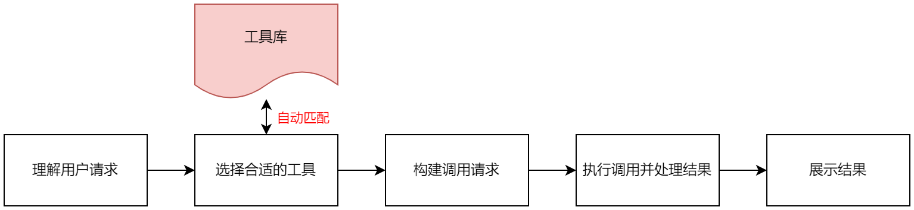

# 大语言模型应用案例分享

>   本文结合个人理解, 介绍几种大语言模型对我们个人或者潜在用户可以提升工作效率的应用案例


## 数据分析

[用GPT4做数据分析](Advanced Data Analysis with GPT4.html)


## 大语言模型工具调用

>   API调用大语言模型: [Gorilla (berkeley.edu)](https://gorilla.cs.berkeley.edu/)


### **什么是工具调用**:

LLM虽然强大, 但由于训练数据和模型性能限制, 通常会存在以下问题:

1.    只能获取训练数据中的事件和内容, **不具备获取最新资料的能力**
2.   通用大语言模型, 训练数据为通用语料数据, 因此**缺乏专业领域知识**
3.   目前通用的大语言模型, 在数学推理层面都存在一些问题, 会**出现计算不准确的问题**

此时, 通过给大模型加上"四肢", 让大模型学会调用工具, 问题变回迎刃而解. 比如说, 通过生成代码解决计算不准确问题 (LLM生成代码能力远强于直接推理能力)


### **自然语言接口**

"自然语言即接口"这一概念指的是利用自然语言（即人们日常交流使用的语言，如中文、英文等）作为与计算机系统或软件交互的界面。这意味着**用户可以通过自然语言来表达指令或查询**，而不需要学习特定的编程语言或命令。这种接口的出现极大地简化了人机交互，使得没有编程背景的普通用户也能够轻松地与复杂的计算机系统进行交流。

在大语言模型的背景下，这一概念得到了进一步的扩展和深化。大语言模型如GPT（Generative Pre-trained Transformer）系列能够理解和生成自然语言文本，这意味着它们可以**理解用户的自然语言指令，并根据这些指令执行相应的操作或生成回应**。这种能力基于以下几个方面：

1.  **理解用户意图**：大语言模型通过预训练和大量的文本数据学习，能够理解用户的查询或命令背后的意图。这种理解不仅限于字面意义，还包括上下文、语境等复杂因素。
2.  **自动识别和调用工具**：现代大语言模型不仅能理解文本，还能与其他软件工具或API接口集成。这意味着模型可以根据理解到的用户意图，自动选择并调用合适的工具来完成任务。例如，如果用户请求翻译文本、生成图片、执行代码或检索信息，模型可以自动识别这些需求并调用相应的翻译服务、图像生成工具、代码执行环境或搜索引擎。
3.  **交互式反馈**：大语言模型可以通过自然语言与用户进行交互，提供反馈、请求更多信息或澄清指令。这种交互使得处理过程更加透明，同时也允许用户以更自然的方式调整或细化他们的请求。

通过这些能力，大语言模型实质上将自然语言转化为了一种强大的用户接口，不仅能够理解用户的指令，还能根据这些指令执行复杂的任务。这大大降低了技术门槛，让更多的人能够利用先进的计算机技术解决问题，创造价值。


### **LLM 调用工具过程**

大语言模型调用工具的过程可以理解为一个交互式的编程环境，其中模型（比如我）可以使用一系列定义好的工具或API来执行特定的任务。这个过程大致可以分为以下几个步骤：




1.  **理解用户请求**：首先，模型需要准确理解用户的请求。这包括解析用户的问题或指令，以及确定哪种工具或API最适合完成请求的任务。
2.  **选择合适的工具**：根据用户的请求，模型会选择一个或多个内置工具（比如**图片生成、执行Python代码、浏览互联网**等）来执行任务。每个工具都有其专门的用途和调用方法。
3.  **构建调用请求**：模型会根据所选工具的API规范，构建一个合适的调用请求。这可能包括设置必要的参数、格式化输入数据等。
4.  **执行调用并处理结果**：模型发送调用请求给选定的工具，然后等待工具执行完成并返回结果。完成后，模型需要解析和处理这些结果，以便以适当的格式回应用户。
5.  **向用户展示结果**：最后，模型将处理后的结果以用户可以理解的方式展示出来。这可能包括直接显示文本、图片、执行结果的摘要等。


### **案例: chatglm 查询包体销售时间**

>   用chatglm3-6b查询包体销售时间理解LLM调用工具的过程, 你也可以试试[chatglm](http://10.44.201.116:8008/)

```text
实践步骤:
1. 注册工具. 即按规范写好python代码, 并写好代码注释(很关键)
2. 用多种不同的语句查询
3. chatglm 思维链解析
```

1.   注册工具

只需写好代码, 以及备注即可. 注意备注非常关键, 是模型将用这个备注匹配用户需求


2.   多种不同语句查询

 分别通过一下几种语句均可实现对包体销售时间的查询. 

-   这个是什么时候卖出去的? 0KBPBVD7A16ABEDBM3705011

-   查下销售时间。OKBPBVD7A16ABEDBM3705011

-   这个电池啥时候卖出去的. 0KBPBVD7A16ABEDBM3705011


3.   chatglm 思维链解析

````text
<|user|>
提出问题

<|assistant|>
思考应该做什么

<|assistant|>调用工具的名称
```python（这里的python是固定格式，并不一定是python语句）
tool_call(调用工具的参数)
```

<|observation|>
工具回复的结果，为一个字符串

<|assistant|> 
（如果知道最后答案）我知道最后答案了，回答用户的问题 
````


### **个人GPT常用工具**:

1.   代码执行器
2.   Web Browser, 浏览器
3.   Dall-E, OpenAI的文本生成图片工具


## AI Agent

待补充


## 其他应用场景:

经典应用场景:

1.   对话机器人
2.   代码编写
3.   文案助手: 文档总结, 创意启发
4.   知识学习
5.   翻译


适用我们用户:

1.   互联网查询代理
     1.   出于数据安全, 大部分公司员工无法连接互联网. LLM可作为代理帮助用户查询互联网数据.
2.   数据分析助手
     1.   数据分析代码生成 + 分析结果可视化 + 数据洞察报告生成


