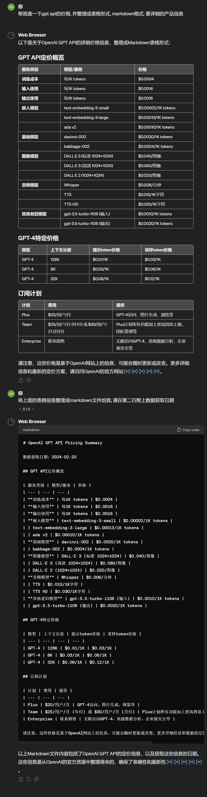

# OpenAI GPT API Pricing Summary

> summary by GPT4 Web Browser extention
> [Newest Price](https://openai.com/pricing)

数据获取日期：2024-02-20

## GPT API定价概览

| 服务类别 | 模型/服务 | 价格 |
| --- | --- | --- |
| **训练成本** | 每1K tokens | $0.0004 |
| **输入使用** | 每1K tokens | $0.0016 |
| **输出使用** | 每1K tokens | $0.0016 |
| **嵌入模型** | text-embedding-3-small | $0.00002/1K tokens |
| | text-embedding-3-large | $0.00013/1K tokens |
| | ada v2 | $0.00010/1K tokens |
| **基础模型** | davinci-002 | $0.0020/1K tokens |
| | babbage-002 | $0.0004/1K tokens |
| **图像模型** | DALL·E 3 (标准 1024×1024) | $0.040/图像 |
| | DALL·E 3 (高清 1024×1024) | $0.080/图像 |
| | DALL·E 2 (1024×1024) | $0.020/图像 |
| **音频模型** | Whisper | $0.006/分钟 |
| | TTS | $0.015/1K字符 |
| | TTS HD | $0.030/1K字符 |
| **其他老旧模型** | gpt-3.5-turbo-1106 (输入) | $0.0010/1K tokens |
| | gpt-3.5-turbo-1106 (输出) | $0.0020/1K tokens |

## GPT-4特定价格

| 模型 | 上下文长度 | 提示token价格 | 采样token价格 |
| --- | --- | --- | --- |
| GPT-4 | 128K | $0.01/1K | $0.03/1K |
| GPT-4 | 8K | $0.03/1K | $0.06/1K |
| GPT-4 | 32K | $0.06/1K | $0.12/1K |

## 订阅计划

| 计划 | 费用 | 提供 |
| --- | --- | --- |
| Plus | $20/用户/月 | GPT-4访问、图片生成、浏览等 |
| Team | $25/用户/月 (年付) 或 $30/用户/月 (月付) | Plus计划所有功能加上更高消息上限、团队管理等 |
| Enterprise | 联系销售 | 无限访问GPT-4、高级数据分析、企业级安全等 |

请注意，这些价格是基于OpenAI网站上的信息，可能会随时更新或改变。更多详细信息和最新的定价方案，请访问OpenAI的官方网站。

## 请求截图

